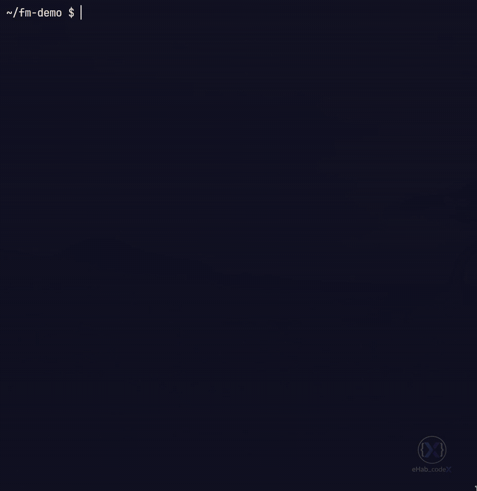

# fm

> A keyboard-driven terminal file manager built on `fzf`, `eza`, and Kitty's
> image protocol.

[](LICENSE)
[](https://www.gnu.org/software/bash/)
[](#requirements)
[](#contributing)



## Features

- 🗂️ **Fuzzy navigation** — `fzf`-driven file list with instant filtering
- 🖼️ **Inline previews** — images, videos, PDFs, and Markdown, rendered by Kitty
- 🖼️ **Gallery grid** — full-screen thumbnail browser with vim-style keys
- 🗑️ **Trash with undo** — `Ctrl-Z` walks back through your last 10 trash operations
- 🔍 **Content search** — `Ctrl-F` runs `ripgrep` on selected files
- 📝 **Bulk rename** — edit a list of names in `$EDITOR`, then commit
- 🌳 **Smart sorting** — by name, size, mtime, or extension
- 🧭 **Jump anywhere** — `zoxide` frecency, bookmarks, git mode
- ⚡ **Cached thumbnails** — invalidation via `mtime+size`, parallel workers
- 🎨 **Nerd Font icons** — via `eza`, with syntax highlighting via `bat`

## Install

### Manual

```bash
git clone https://github.com/eHab-codeX/fm.git ~/.local/share/fm
ln -sf ~/.local/share/fm/fm ~/.local/bin/fm
